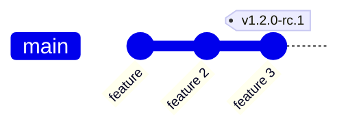
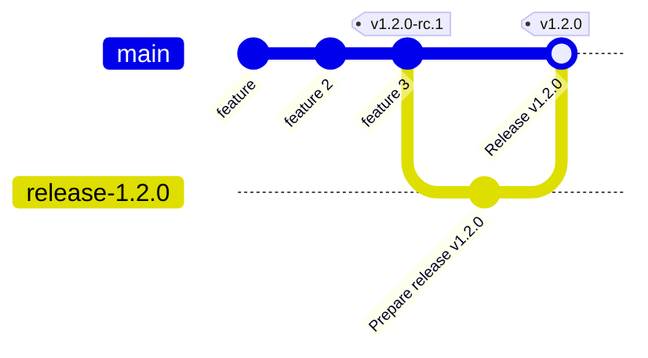
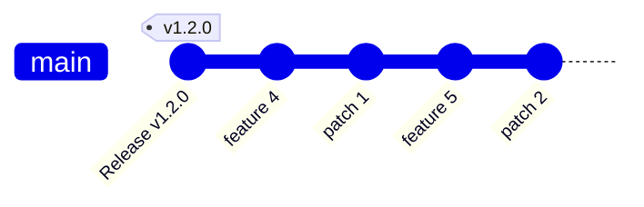

# Release Workflow

This document is both the process design (what the release model looks like) and the operational playbook (what to actually do, what breaks, what to verify). Companion to [`agents/changelog.md`](./agents/changelog.md), which is the canonical changelog process.

## When to use this guide

You are about to:

- Tag a release candidate (`vX.Y.0-rc.N`).
- Cut a regular release (`vX.Y.0`).
- Cut a patch release (`vX.Y.Z` with `Z > 0`).
- Triage cherry-picks before a patch release.
- Investigate why CI is misbehaving on a tag push.
- Review a `Prepare release` PR.

If you are about to generate a changelog only, jump straight to [`agents/changelog.md`](./agents/changelog.md).

## Introduction

Cozystack uses a staged release process to ensure stability and flexibility during development.

There are three types of releases:

- **Release Candidates (RC)** – Preview versions (e.g., `v1.2.0-rc.1`) used for final testing and validation.
- **Regular Releases** – Final versions (e.g., `v1.2.0`) that are feature-complete and thoroughly tested.
- **Patch Releases** – Bugfix-only updates (e.g., `v1.2.1`) made after a stable release, based on a dedicated release branch.

All three are matched by `tags.yaml`'s regex `^v\d+\.\d+\.\d+(-(alpha|beta|rc)\.\d+)?$`. The tag push is the trigger for the whole pipeline. **Always push tags with `git push origin HEAD:refs/tags/<tag>`** so GitHub fills `base_ref` — `tags.yaml`'s `Get base branch` step refuses tags pushed without a base.

## Release Candidates

Release candidates are Cozystack versions that introduce new features and are published before a stable release.
Their purpose is to help validate stability before finalizing a new feature release.
They allow for final rounds of testing and bug fixes without freezing development.

Release candidates are given numbers `vX.Y.0-rc.N`, for example, `v1.2.0-rc.1`.
They are created directly in the `main` branch.
An RC is typically tagged when all major features for the upcoming release have been merged into main and the release enters its testing phase.
However, new features and changes can still be added before the regular release `vX.Y.0`.

Each RC contributes to a cumulative set of release notes that will be finalized when `vX.Y.0` is released.
After testing, if no critical issues remain, the regular release (`vX.Y.0`) is tagged from the last RC or a later commit in main.
This begins the regular release process, creates a dedicated `release-X.Y` branch, and opens the way for patch releases.

## Regular Releases

A regular release `vX.Y.0` is **promoted from a release-candidate that already passed e2e** — never tagged by hand and never rebuilt. The bytes shipped as `vX.Y.0` are the exact `vX.Y.0-rc.N` images, retagged by digest. We'll use `v1.2.0` as an example.



A regular release sequence runs as follows:

1. Tag the last good commit on `main` as a release candidate (`v1.2.0-rc.N`) and push it with `git push origin HEAD:refs/tags/v1.2.0-rc.N`. CI builds the rc images, drafts the rc release, and pushes the digest-vendored `release-1.2.0-rc.N` staging branch.
2. Validate the rc. New features and fixes can still land on `main` and be picked up by a later rc.
3. Once an rc is green, run the [`promote-rc.yaml`](../.github/workflows/promote-rc.yaml) workflow (manual dispatch) with that rc tag. Promotion is **transactional** — it performs no registry mutation at dispatch. It:
   1. Pushes the `release-1.2.0` branch: the rc's digest-vendored tree with the rc version substring rewritten to `1.2.0` (the digests are the rc's — unchanged).
   2. Drafts the `v1.2.0` release and uploads the (restamped) assets.
   3. Opens the `chore(release): promote v1.2.0-rc.N -> v1.2.0` PR into `main`, labelled `release` and `full-e2e` (the latter forces the full e2e suite on the PR). The retag itself is deferred to the merge (step 5) — so an abandoned promotion leaves no stable-named images and cannot wedge a re-promotion.

   ```mermaid
   gitGraph
       commit id: "feature"
       commit id: "feature 2"
       commit id: "feature 3" tag: "v1.2.0-rc.1"
       branch release-1.2.0
       checkout release-1.2.0
       commit id: "Prepare release v1.2.0"
       checkout main
       merge release-1.2.0 id: "Pull Request"
   ```

4. Maintainer reviews the PR and the draft release, then merges it — **do not squash-merge**, the stable tag must attach to a real merge commit. GitHub removes the merged branch `release-1.2.0` (the repo has auto-delete-on-merge enabled).
5. CI workflow triggers on merge (this is where every irreversible side effect happens, all after the PR's e2e passed):
   1. Creates the tag `v1.2.0` at the newly created merge commit — write-once. The tag is published here for the first time, never moved.
   2. Cuts the write-once `api/apps/v1alpha1/v1.2.0` Go-module tag at the same commit.
   3. Ensures the `release-1.2` maintenance branch exists at the tag commit.
   4. Publishes the release page (`draft` → `latest`).
   5. Retags the rc's images by digest to `v1.2.0` (and `:latest` only when `v1.2.0` is the newest published stable), and publishes the stable `cozy-installer` chart — no rebuild.
6. The maintainer can now announce the release to the community.



## Patch Releases

Making a patch release has a lot in common with a regular release, with a couple of differences:

* The rc and its promotion happen on the `release-X.Y` maintenance branch instead of `main`.
* Patch commits are cherry-picked to that branch before the rc is tagged.


Let's assume that we've released `v1.2.0` and that development is ongoing.
We have introduced a couple of new features and some fixes to features that we have released 
in `v1.2.0`.

Once problems were found and fixed, a patch release is due.




1. The maintainer creates a release branch, `release-1.2,` and cherry-picks patch commits from `main` to `release-1.2`.
   These must be only patches to features that were present in version `v1.2.0`.

   Cherry-picking can be done as soon as each patch is merged into `main`,
   or directly before the release.

   ```mermaid
   gitGraph
       commit id: "Release v1.2.0" tag: "v1.2.0"
       branch release-1.2
       checkout main
       commit id: "feature 4"
       commit id: "patch 1"
       commit id: "feature 5"
       commit id: "patch 2"
       checkout release-1.2
       cherry-pick id: "patch 1"
       cherry-pick id: "patch 2"
   ```

   When all relevant patch commits are cherry-picked, the branch is ready for release.

2. The maintainer tags the `HEAD` commit of branch `release-1.2` as a release candidate (`v1.2.1-rc.N`) and pushes it. CI builds the rc images, drafts the rc release, and pushes the `release-1.2.1-rc.N` staging branch.
3. Validate the rc.
4. Once the rc is green, run [`promote-rc.yaml`](../.github/workflows/promote-rc.yaml) (manual dispatch) with that rc tag. It pushes the `release-1.2.1` branch (rc digests, tag string rewritten to `1.2.1`), drafts the `v1.2.1` release with the restamped assets, and opens the promote PR into `release-1.2` (labelled `release` + `full-e2e`). As with a regular release the retag is deferred to the merge — no registry mutation at dispatch.

   ```mermaid
   gitGraph
       commit id: "Release v1.2.0" tag: "v1.2.0"
       branch release-1.2
       checkout main
       commit id: "feature 4"
       commit id: "patch 1"
       commit id: "feature 5"
       commit id: "patch 2"
       checkout release-1.2
       cherry-pick id: "patch 1"
       cherry-pick id: "patch 2" tag: "v1.2.1-rc.1"
       branch release-1.2.1
       commit id: "Prepare release v1.2.1"
       checkout release-1.2
       merge release-1.2.1 id: "Pull request"
   ```

   Finally, when release is confirmed, the release sequence goes on.

5. Maintainer reviews and merges the PR — **do not squash-merge**. GitHub removes the merged branch `release-1.2.1` (auto-delete-on-merge is enabled).
6. CI workflow triggers on merge (all irreversible side effects, post-e2e):
   1. Creates the tag `v1.2.1` at the newly created merge commit — write-once. The tag is published here for the first time, never moved.
   2. Cuts the write-once `api/apps/v1alpha1/v1.2.1` Go-module tag at the same commit.
   3. Publishes the release page (`draft` → `latest`; `latest` moves only if `v1.2.1` is the newest published stable).
   4. Retags the rc's images by digest to `v1.2.1` and publishes the stable `cozy-installer` chart — no rebuild.
7. The maintainer can now announce the release to the community.

## What CI does during the release process

The numbered process above is implemented by four workflows. Knowing which job does what makes the failure modes much easier to diagnose.

1. [`tags.yaml`](../.github/workflows/tags.yaml) — fires on an rc tag push: runs `prepare-release`, then `generate-changelog`, then `update-website-docs`.
2. [`promote-rc.yaml`](../.github/workflows/promote-rc.yaml) — manual dispatch: stages the `release-X.Y.Z` tree (rc digests, tag string rewritten to stable), drafts the stable release, and opens the `release-X.Y.Z` promote PR. No registry mutation — transactional.
3. [`pull-requests-release.yaml`](../.github/workflows/pull-requests-release.yaml) — fires when the `release-X.Y.Z` PR merges; finalizes the release: cuts the write-once stable + Go-module tags, publishes, then retags the rc images to stable by digest (`:latest` gated on newest-stable) and publishes the stable chart.
4. [`update-releasenotes.yaml`](../.github/workflows/update-releasenotes.yaml) — fires on every push to `main`; syncs `docs/changelogs/v*.md` content into the corresponding GitHub Release body.

### Phase 1 — `prepare-release` (hard gate)

On an rc tag push: builds images, commits digest pins, creates the draft release, and pushes the `release-X.Y.Z-rc.N` staging branch. (The stable promote PR is opened later by `promote-rc.yaml`, not here. When the stable tag itself is pushed by finalize, a draft already exists, so this job is a no-op — see [Phase 5](#phase-5--pull-requests-releaseyaml-finalize).)

The commit (`Prepare release vX.Y.Z`, authored by `cozystack-ci[bot]`) is **digest pins and image tags only**:

- `packages/core/{installer,platform,testing}/values.yaml`
- `packages/system/*/values.yaml` (cozystack-api, dashboard, kamaji, linstor, kubevirt-csi-node, etc.)
- `packages/apps/kubernetes/images/{kubevirt-csi-driver,ubuntu-container-disk-*}.tag`
- `packages/system/dashboard/templates/configmap.yaml` (the `$tenantText` value)

Things that look surprising in the diff but are normal:

- **Zero-diff packages**: when buildx fully caches and upstream base images haven't moved, the digest is byte-identical to the previous release and won't appear. Verify the build step actually ran — don't assume "no diff = nothing built."
- **Sudden churn on `ubuntu-container-disk-*` tags**: `cloud-images.ubuntu.com/noble/current/` is a moving target; these often rebuild even without code changes.
- **Switched registry**: if a self-built image moved from `docker.io` to `ghcr.io`, the registry portion of the digest changes — that's a deliberate move, not a regression.
- **`targetVersion` is NOT touched by the release PR.** Platform migration `targetVersion` is bumped earlier in a feature commit (e.g. `[platform] Bump migration targetVersion to 39 for migration 38`). The release PR only re-pins the `platform-migrations` image digest.

### Phase 2 — `generate-changelog` (non-blocking)

Uses a separate **read-only** GitHub App token (`permission-contents: read`, `permission-pull-requests: read`, `permission-metadata: read`) for the AI step, so the model cannot mutate the repo even with `--allow-all-tools`. Branch creation, commit, push, and PR creation happen in subsequent steps under a write-scoped token.

The job runs with `continue-on-error: true`. A green tag CI run does **not** imply a changelog landed — check that the `changelog-vX.Y.Z` PR exists with content. If it does not, follow [`agents/changelog.md`](./agents/changelog.md) manually.

Known reasons this phase fails silently:

- Copilot quota exhausted (`COPILOT_GITHUB_TOKEN` 402). Refill or rotate. Drafts still get created by Phase 1; you have to open the changelog PR by hand.
- AI step timeout (hard 30-min cap).
- Output file empty — caught by the next step's `[ -s ]` check, fails loudly.

### Phase 3 — `update-website-docs`

Runs with `if: always() && needs.prepare-release.result == 'success'` so it survives a failed changelog phase. Decides whether to promote `next/` → `vX.Y/` in the website repo (only for non-prerelease tags where the version directory doesn't yet exist), runs `make update-all`, then stages `content hugo.yaml data/versions` and opens a PR against `cozystack/website`.

If anyone changes the website Makefile to write somewhere else (e.g. `static/`, `i18n/`), the `git add` list must grow or the PR silently drops files.

### Phase 4 — review and merge `chore(release): cut vX.Y.Z`

Reviewer checklist:

- [ ] Diff is digest pins + image tags only — nothing else.
- [ ] No accidental config drift (a value file you don't recognize).
- [ ] If any chart bumped, check the new digest pulls — `crane manifest ghcr.io/cozystack/cozystack/<name>@<digest>` should return.
- [ ] Build artifacts on the draft release page exist and match the expected count.
- [ ] Changelog PR exists, has content, and the entries match the commit range (see [Changelog pre-publish verification](#changelog-pre-publish-verification)).

### Phase 5 — `pull-requests-release.yaml` (finalize)

Fires on merge of a PR that is merged, carries the `release` label, and is authored by `cozystack-ci[bot]` (the last guard closes the "name a branch `release-X.Y.Z`, get it labelled, merge it" hole). Head branch must match `release-X.Y.Z[-suffix]`. This is where **every irreversible side effect of a promotion happens** — after the PR's e2e passed and the PR merged, making promotion transactional. Steps:

1. **Create the tag at the merge commit** (write-once). The merge commit of `Prepare release vX.Y.Z` did not exist before the PR opened, so there is nothing to move — the tag is created here for the first time. A pre-existing tag at a different commit fails the step loudly rather than being force-moved (see [Tag immutability](#tag-immutability)).
2. **Cut the `api/apps/v1alpha1/vX.Y.Z` Go-module tag** (write-once, stable only) at the same commit, so Go consumers of `api/apps/v1alpha1` get the release. Moved here from `tags.yaml`, whose `prepare-release` body is skipped for a promoted stable (the draft already exists).
3. **Ensure the maintenance branch `release-X.Y` exists** at the tag commit. Created if missing; updated fast-forward-only — a non-fast-forward update warns and is left for a maintainer rather than being force-updated.
4. **Publish the draft release.** `make_latest` is computed against published-non-prerelease tags: prereleases stay `false`; tags older than the current max stay `false` (and the current max is force-restored to `latest` if necessary, so an older patch tag cut after a newer minor won't downgrade `latest`).
5. **Retag the rc images to stable** by digest (`hack/promote-retag.sh`, no rebuild) and **publish the stable `cozy-installer` chart**. `:latest` (on both the images and the chart) moves only when this release's `make_latest` was `true` — the same decision as step 4, so the release's `latest` and the images' `:latest` never disagree. The chart is packaged with `platformVersion` stamped into its default values so the documented `helm --install --version X.Y.Z` path reports the stable version.

### Phase 6 — `update-releasenotes.yaml` (sync GitHub Release body)

Fires on every push to `main`. Reads each `docs/changelogs/vX.Y.Z.md` and PATCHes the matching GitHub Release's `body` if it differs. So edits to a published changelog file land on the GitHub Release on the next push to `main`, without re-running the release flow.

## Stable tags come from rc promotion

A stable `vX.Y.Z` is created only by **promoting an existing release-candidate** that already passed e2e — never by rebuilding and never by a cron.

- [`promote-rc.yaml`](../.github/workflows/promote-rc.yaml) is triggered manually once an rc has gone green. It rewrites the rc version substring in the vendored image tags (the digests stay the rc's) and opens the `release-X.Y.Z` staging PR — no registry mutation. Merging that PR (Phase 5) creates the write-once stable tag at the merge commit, then retags the rc's already-built, e2e-passed image digests to the stable tag **by digest** (no rebuild — see [`hack/promote-retag.sh`](../hack/promote-retag.sh)) and publishes the release. Because the copy source is the immutable rc digest, the stable image is bit-for-bit the rc image that passed e2e — and because the retag runs only after merge, an abandoned promotion never leaves stable-named bytes behind.

So a commit on a supported `release-X.Y` line ships when a maintainer promotes the next rc for that line — not automatically within 24h. Pushing a stable `vX.Y.Z` tag by hand is **not** a supported path: `tags.yaml` fails fast on a stable tag that has no pre-existing draft ("stable tags come from promote-rc.yaml"), and even so the finalize step would refuse to move a pre-existing tag. Release candidates (`vX.Y.Z-rc.N`) are still pushed by hand — [`tags.yaml`](../.github/workflows/tags.yaml) fires on the rc tag push, builds it, and publishes the rc release.

## Nightly builds

A nightly is an **installable copy of `main` on GHCR — not a rebuild and not a release**. [`build-main.yaml`](../.github/workflows/build-main.yaml) already builds every push to `main` into the CI registry (OCIR); the nightly promotes that build to the public release registry (GHCR) and proves it installs.

[`nightly.yaml`](../.github/workflows/nightly.yaml) runs daily (gated by the `NIGHTLY_ENABLED` repo variable) in three stages:

1. **mirror** — resolve the exact commit `cozystack-packages:main` was built from, then [`hack/nightly-mirror.sh`](../hack/nightly-mirror.sh) copies every cozystack-owned component image OCIR→GHCR **by digest** (bit-for-bit, no rebuild) and re-publishes the rewritten `cozystack-packages` artifact and the `cozy-installer` chart to GHCR, tagged `0.0.0-nightly.<YYYYMMDD>.<run-id>.<attempt>` plus a floating `nightly`.
2. **build-disk** — assemble the Talos `nocloud` disk from the upstream siderolabs imager (the profile references only `ghcr.io/siderolabs/*`, so this needs no cozystack image and no rebuild) and publish it as a GHCR OCI artifact (`cozystack-nocloud`) so a nightly is installable on real hardware, not just in e2e.
3. **e2e** — stage the published GHCR closure (rewritten tree + the `cozy-installer` chart pinned to the GHCR packages artifact + the disk) and run the **full** app suite. A nightly has no diff, so Test Impact Analysis does not apply.

No GitHub release and no `api/apps/v1alpha1/*` Go-module tag are created for a nightly. [`retention.yaml`](../.github/workflows/retention.yaml) prunes old GHCR nightly versions (keeps the newest 14 per package; the floating `nightly`, release tags and untagged versions are never touched).

Install a nightly:

```bash
helm upgrade --install cozystack \
  oci://ghcr.io/cozystack/cozystack/cozy-installer --version 0.0.0-nightly.20260626.15992304129.1
# ...or --version nightly for the latest
```

The matching Talos node image is `ghcr.io/cozystack/cozystack/cozystack-nocloud:0.0.0-nightly.20260626.15992304129.1` (pull with `oras`).

## Backports

### The backport bot

[`backport.yaml`](../.github/workflows/backport.yaml) wraps [`korthout/backport-action`](https://github.com/korthout/backport-action) and fires on a merged `main`-targeted PR carrying one of:

| Label | Target branch |
|-------|---------------|
| `backport` | `release-X.Y` (current latest minor) |
| `backport-previous` | `release-X.(Y-1)` |

Resolution is dynamic via `getLatestRelease` at run time — no need to hardcode branch names.

The bot creates a backport PR with title `[Backport release-X.Y] <original title>`. When this PR merges, the title prefix used to re-trigger the bot through `pr-labeler.yaml`, which auto-applied `backport` to any `[Backport release-X.Y]`-titled PR. Combined with the org-level `dosubot` re-applying the label, this caused recursive backports.

The fix (PR #2584): both job `if:` blocks gate on `github.event.pull_request.base.ref == 'main'`. Backport PRs target `release-X.Y`, so they cannot satisfy this — architectural protection, regardless of which bot relabels them.

### When the bot fails

Conflicting cherry-picks produce a draft PR via `conflict_resolution: draft_commit_conflicts`. Look for the bot's comment with the merge-conflict diff. You either:

- Resolve in the draft branch and undraft, or
- Drop the bot's branch and cherry-pick manually:

```bash
git checkout release-X.Y
git cherry-pick -x -s <commit-sha>
# resolve conflicts
git commit -s
git push origin release-X.Y  # or push to a new branch and open a PR
```

To find the bot's failed comments across a batch of PRs:

```bash
for n in $(gh pr list --search "label:backport label:backport-previous merged:>=2026-01-01" --json number --jq '.[].number'); do
  echo "=== #$n ==="
  gh pr view $n --json comments --jq '.comments[] | select(.author.login == "github-actions" or (.author.login | contains("backport"))) | .body' | head -20
done
```

### Cherry-pick triage before a patch

A patch release includes bugfixes for code that shipped in the corresponding minor `vX.Y.0`. Use:

```bash
# 1. Inventory PRs already labeled for backport (merged but not yet on release-X.Y)
gh pr list --search "is:merged label:backport" --limit 100
gh pr list --search "is:merged label:backport-previous" --limit 100

# 2. List commits on main since the release branch diverged that are NOT yet on release-X.Y
git merge-base origin/main origin/release-X.Y
git log <base>..origin/main --grep="(#" --oneline

# 3. Open PRs that may need labeling before the cut
gh pr list --state open --base main --label kind/bug
```

**Include rule:**

- `kind/bug` — especially destructive (data loss, crash-loop, OOM, eviction).
- `area/security` / CVE.
- Narrow chart fixes whose blast radius is contained (e.g. one operator's resources).
- Patch-line-policy-matching dependency bumps (e.g. cilium 1.X.Y → 1.X.(Y+1) on a `release-A.B` shipping cilium 1.X — never a minor bump, only a patch within the line the branch already ships).

**Skip rule:**

- `kind/feature` — even with `lgtm`. A patch release is not a delivery vehicle for features.
- CI-only changes (`area/ci`, test infrastructure).
- Docs-only changes (those land via `update-website-docs` automatically).
- Large multi-package dependency churn (Dependabot Go-deps bumps).
- PRs whose conventional-commit type is `!` (breaking) or that mix `feat` with `fix`.

**Borderline cases:**

- Large refactors with `lgtm` AND an obvious bug payload — prefer extracting the bug fix into a narrower commit and backporting only that.
- PRs labeled both `kind/bug` and `kind/feature` — split them.

### Backporting code that touches monotonic counters

Migrations are the canonical case. `packages/core/platform/images/migrations/run-migrations.sh` is a linear counter — it runs `seq $CURRENT_VERSION $((TARGET_VERSION - 1))` and stops if `CURRENT >= TARGET`. This creates a forward-upgrade trap. Walking through it with `release-1.2` as the maintenance branch:

- `main` has `targetVersion=10` and migrations 1–9 on disk.
- The `release-1.2` branch was cut when `targetVersion=5` (migrations 1–4 on disk).
- You backport a new migration to `release-1.2` at slot 5, and naively bump `targetVersion` 5 → 6 to enable it.
- Customer running 1.2.x runs the new migration, stamps `cozystack-version=6` in-cluster.
- On upgrade to 1.3 (main's `targetVersion=10`), the runner walks `seq 6 9` and runs main's migrations 6–9 — **main's own migration at slot 5 never runs.** The backport claimed that slot on `release-1.2`; main's slot 5 holds an unrelated migration that gets silently skipped.

Mitigations, in order of preference:

1. **Don't bump `targetVersion` in the backport.** Just ship the migration file. Prior precedent in the repo: an earlier maintenance branch's ACME backport did exactly this — the migration shipped but ran on no clusters until a later commit raised the counter. Pair this with relaxing the chart-side `{{ fail }}` guard on the maintenance branch (chart-side coalesce) so the new value works without the migration having executed.
2. **If you must bump,** add an idempotent duplicate of the now-skipped main migration at a higher slot. Bounded cost (one extra file per affected migration) and survives the skip window.
3. **Audit cross-branch counter state before deciding.** Compare migration numbering across `main`, `release-X.Y`, and `release-X.(Y-1)`. If a backport would create a skip window on any forward-upgrade path, choose option 1.

This rule generalizes to any monotonic-counter state: schema versions, feature-flag generations, anything that gates "have I run X yet?" with a single integer.

## Changelogs

### Where the canonical process lives

[`agents/changelog.md`](./agents/changelog.md) is the source of truth. Read it end-to-end before generating; do not infer the process from past commits or memory. The CI runs it under Copilot via `tags.yaml::generate-changelog`; locally the same prompt is replayable by following the doc directly.

### Common changelog failure modes

These are mistakes that have shipped in real changelogs. Verify against each before merging the changelog PR.

**1. Commits from outside the release range.** Caused by running `git log <prev>..HEAD` from `main` while generating a patch changelog — `HEAD` on `main` contains everything that landed since the tag plus backports merged to `release-X.Y` after the tag was cut. Use `git log <prev>..<new_tag>` explicitly. The doc was updated to require this after v1.3.1's changelog shipped with 14 entries for what was actually a 1-commit release.

**2. Original + backport listed as two separate entries.** Each backport must coalesce with its original into a single entry of the form `(in #orig, backport #bp)`. To verify after generation:

```bash
# Every entry that mentions "backport" should also reference the original PR number
grep -E 'backport #[0-9]+' docs/changelogs/v<new>.md | grep -v '#[0-9]*, backport'
```

Output should be empty.

**3. Wrong PR author.** The squash-merge commit's author is whoever clicked "Merge" — not the person who wrote the code. **Always** resolve via `gh pr view <N> --json author --jq .author.login`, never `git log --format=%an`. This bites hardest for website-repo entries where the same merger handles most PRs.

**4. Superseding patch, stale changelog.** Tags are write-once, so a critical fix after `vX.Y.Z` ships as the next patch `vX.Y.(Z+1)` rather than moving the tag. If a changelog PR already exists for a tag you are superseding, the changelog work transfers to the new patch. Compare `git log <prev>..<new>` against what the existing `changelog-vX.Y.Z` branch already documents; only add/remove the deltas. If the only new commits are CI-internal or a revert of a feature that never reached a stable tag, no changelog edit is needed.

**5. PR numbers swapped inside prose.** The entry-format validator checks bullet entries but ignores Feature Highlights paragraphs and Upgrade Notes. Both have caused wrong PR references in shipped changelogs. Verify every `#NNNN` in prose with `gh pr view <N>`.

**6. Hallucinated entries.** Every entry must correspond to a commit in `git log <prev>..<new>`. Verify by extracting PR numbers from the file and grep-searching the commit range:

```bash
grep -oE '#[0-9]+' docs/changelogs/v<new>.md | sort -u | while read pr; do
  n=${pr#\#}
  if ! git log <prev>..<new> --grep="#${n}" --oneline | grep -q .; then
    echo "PR $pr in changelog but not in commit range"
  fi
done
```

**7. Bot accounts as human contributors.** `cozystack-ci[bot]`, `github-actions`, `dependabot`, `renovate`, and any `app/*` login must NOT appear in the `## Contributors` list. They legitimately appear in **per-entry attribution** (e.g. a Renovate-authored PR) — but not in the human roll-call.

**8. Title duplicated as description.** `* **fix(foo): X**: fix(foo): X (...)` means you wrote the conventional-commit subject twice and never wrote a user-facing description. The brief and the detail must say different things — the detail explains what the change means for users.

### Changelog pre-publish verification

Run these checks before merging the changelog PR. Catches problems in roughly the order they occur:

```bash
PREV=v1.2.0; NEW=v1.2.1

# A. Every chart bump is mentioned somewhere in the changelog
git diff --name-only $PREV..$NEW -- 'packages/*/charts/*/Chart.yaml' 'packages/*/*/charts/*/Chart.yaml' | while read f; do
  old=$(git show "$PREV:$f" 2>/dev/null | yq '.version // ""')
  new=$(git show "$NEW:$f" 2>/dev/null | yq '.version // ""')
  if [ "$old" != "$new" ]; then
    component=$(basename "$(dirname "$f")")
    if ! grep -qi "$component" docs/changelogs/$NEW.md; then
      echo "MISSING: $component $old -> $new ($f)"
    fi
  fi
done

# B. Out-of-Chart.yaml pins (Talos, tenant K8s, vendored images)
for path in packages/core/talos/values.yaml packages/core/installer/values.yaml packages/apps/kubernetes/values.yaml; do
  git diff $PREV..$NEW -- "$path" | head -40
done
git diff --name-only $PREV..$NEW -- 'images/*/Dockerfile'

# C. Every cited #NNNN exists and is a merged PR (not an issue)
grep -oE '#[0-9]+' docs/changelogs/$NEW.md | sort -u | sed 's/#//' | xargs -P 20 -I{} sh -c '
  state=$(gh api /repos/cozystack/cozystack/issues/{} --jq ".pull_request.merged_at // \"ISSUE\"" 2>/dev/null)
  echo "#{} $state"
' | grep -E 'ISSUE|null|^#[0-9]+ $'

# D. URL liveness
grep -oE 'https://[^)" ]+' docs/changelogs/$NEW.md | sort -u | xargs -P 10 -I{} sh -c '
  code=$(curl -s -o /dev/null -w "%{http_code}" {})
  if [ "$code" != "200" ]; then echo "$code {}"; fi
'

# E. Website PR authors are PR authors, not commit authors
grep -oE 'cozystack/website#[0-9]+' docs/changelogs/$NEW.md | sort -u | sed 's|cozystack/website#||' | while read n; do
  pr_author=$(gh pr view $n --repo cozystack/website --json author --jq .author.login)
  echo "website#$n -> @$pr_author"
done

# F. Working tree clean except for the changelog
git status --porcelain | grep -v "docs/changelogs/$NEW.md"
# Should output nothing.
```

Ship criterion: every chart bump surfaced, no issue-cited-as-PR, no 404 URLs, every website entry attributed via `gh pr view` (not commit author), `git status` shows only the changelog.

### Cozystack-specific URL quirks

`cozystack.io` paths are versioned: `/docs/operations/foo/` and `/docs/next/foo/` both 404. Only `/docs/vX.Y/foo/` and the unversioned canonical `/docs/foo/` serve content. AI-generated changelogs invent the unversioned form. Verify URLs with the `curl` loop above.

### Platform-component coverage

For a minor release (`vX.Y.0`), changelog entries should surface what an upstream chart bump actually brought in — features, breaking changes, security fixes. PR commit messages usually don't capture this; the upstream `CHANGELOG.md` or GitHub Release notes do. For each bumped `Chart.yaml`:

1. Read the `sources:` field — typically a GitHub URL.
2. Fetch release notes strictly inside `old < x <= new` via `gh release view <tag> --repo <owner>/<repo> --json body,name`.
3. Summarize in 2–5 user-impact bullets per component (new features, breaking changes, CVEs, important deprecations). Don't reproduce upstream notes verbatim; link to them.
4. If a PR-level entry already mentions the bump, enrich that entry with bullets — don't duplicate the entry.
5. If 3+ bumps have no PR-level mention, introduce a `## Platform Components` section.

If you can't find upstream notes for a bumped component, list it with version-only info and no bullets. Hallucinated bullets are worse than missing detail.

## Release-time fires — what's gone wrong recently

These are real regressions that escaped to users. The pattern in each: code passed CI, shipped in a stable release, broke customers. Read them as a working list of pre-release verification gaps.

### v1.3.0 — cert-manager ingressClassName regression (fix #2562)

**Bug:** A commit migrated ACME HTTP-01 to use the modern `acme.cert-manager.io/http01-ingress-ingressclassname` annotation. The matching ingress-shim code that reads that annotation was added by cert-manager upstream PR #8244 and was **never backported** to the `release-1.19` branch — but cozystack 1.3.0 shipped cert-manager v1.19.3. The annotation was silently dropped at runtime and every solver Ingress fell back to the ClusterIssuer's default class `tenant-root`. Let's Encrypt validation broke for every tenant whose `publishing.ingressName != tenant-root`.

**Blast radius:** v1.3.0, v1.3.1, and v1.1.7 (the migration was cherry-picked to `release-1.1`).

**Why CI missed it:** the migration commit was self-contained and `helm template` rendered cleanly. There was no E2E that creates a tenant with a non-default ingress class and watches a real Let's Encrypt cert issue. Verification had been done from the docs side ("the API has been available since cert-manager 1.12"), not against the shipped cert-manager source.

**Would have caught it:** non-root-tenant E2E with LE-staging cert issuance, asserting the solver Ingress lands on the tenant's class.

### v1.4.0 — kubevirt-instancetypes upgrade failure (fix #2612)

**Bug:** `packages/system/kubevirt-instancetypes/Makefile` contained `sed -i '/persistent: true/d' templates/preferences.yaml`, which stripped the only child of `preferredTPM`, leaving `preferredTPM:` (null) in six Windows preferences. KubeVirt v1.6.x silently accepted it. The v1.6.3 → v1.8.2 operator bump (2026-04-27) hardened the CRD's OpenAPI schema and started rejecting null for an object-typed field. `helm upgrade` then failed on every cluster with `kubevirt-instancetypes` enabled.

**Why CI missed it:** the kubevirt-operator bump and the inert `preferences.yaml` were two weeks apart in commit history. CI only tests fresh installs against the new CRDs; it doesn't run `helm upgrade` from prior versions. Schema regression on a vendored asset that hadn't been touched in 18 months.

**Would have caught it:** `helm template <new chart> | kubectl apply --dry-run=server -f -` against the freshly-installed CRDs of every bumped operator. Or an upgrade-from-N-1 E2E lane.

### v1.4.0 — Flux 2.7 → 2.8 readiness deadlock (#2602)

**Bug:** helm-controller v1.5.0 (shipped in Flux 2.8) changes the default wait strategy to kstatus polling, which polls **every applied resource including child HelmReleases**. The `packages/apps/kubernetes` umbrella has 19 child HRs that each `dependsOn: parent` (with a `lookup` guard so the dependency only activates after the parent exists). Pre-2.8: parent went Ready as soon as Helm returned. Post-2.8: parent waits for children, children wait for parent. Deadlock.

**Why CI missed it:** the cycle only manifests on the second reconcile (parent exists, so the `lookup` activates the child's `dependsOn`). Fresh-install E2E dodges this — the parent-already-exists branch isn't taken on the first apply.

**Would have caught it:** apply-mutate-reapply E2E (any chart bump in the kubernetes umbrella triggers a second reconcile). Plus an explicit PR-template requirement: for any flux/helm-controller bump, paste the upstream breaking-changes section into the PR body.

### Patterns these share

1. **Fresh-install CI is insufficient.** All three regressions passed fresh-install lanes.
2. **Upstream breaking-defaults bumps are the common shape.** kubevirt CRD hardening, helm-controller default wait strategy, cert-manager API surface drift. Pre-merge reading of upstream changelogs would have caught two of three.
3. **One-engineer-bitten-once is the only safety net for live verification.** The cert-manager bump PR included an explicit live-cluster verification step — because the same engineer had been bitten the prior week. There is no checklist requiring it.

## Pre-release verification checklist

For RCs and final releases, run this before merging the release PR. Each item is here because something has shipped without it and broken users.

- [ ] **Upgrade from previous patch** (`vX.Y.(Z-1)`) on a real cluster. `helm upgrade` succeeds, all HelmReleases reach Ready, no CRD schema rejections.
- [ ] **Upgrade from previous minor** (`v(X-1).Y.0`) for RC and minor releases. Same assertions.
- [ ] **At least one tenant with `publishing.ingressName != tenant-root`** and a real Let's Encrypt-staging cert issuance.
- [ ] **Apply-mutate-reapply** on the kubernetes umbrella HelmRelease (catches second-reconcile bugs).
- [ ] **For every CRD-source bump** (kubevirt, cert-manager, flux, cilium, kamaji): `helm template | kubectl apply --dry-run=server` against the freshly-installed CRDs.
- [ ] **For every flux / helm-controller / kubevirt-operator / cert-manager bump:** paste the upstream breaking-changes section of the bump's CHANGELOG into the PR body before merge.
- [ ] **After cutting the tag,** watch `pull-requests-release.yaml::Finalize Release`. If it fails on `Draft release for v... not found`, undraft the release manually and file the workflow regression — this has been a known recurring failure since the `Publish draft release` step lost its explicit `github-token` in refactor `66a756b6`.
- [ ] **Changelog PR exists and was verified** per [Changelog pre-publish verification](#changelog-pre-publish-verification).

## CI failures release engineers commonly hit

| Symptom | Class | Diagnosis | Block release? |
|---------|-------|-----------|----------------|
| `Draft release for vX.Y.Z not found` on every release-* merge | Workflow regression — `Publish draft release` lost its `github-token` in a past refactor; default `GITHUB_TOKEN` cannot list drafts | At `pull-requests-release.yaml:163`. Undraft manually, file the fix | No |
| Changelog Copilot job returns 402 | Token quota — `COPILOT_GITHUB_TOKEN` premium-request quota empty | All tag CI runs that day fail the changelog phase | No — `continue-on-error: true`, generate changelog by hand following [`agents/changelog.md`](./agents/changelog.md) |
| E2E `kubernetes-test` fails with `CSINode does not contain driver csi.kubevirt.io` | Test ordering bug | Tenant's `kubernetes-${test_name}-csi` HelmRelease still installing when NFS PVC is created. Fix: wait for `csinode/<node>` to advertise the driver before creating the PVC | Yes — flaky and masks real CSI bugs |
| `tenant-root` HR in perpetual upgrade-rollback loop after OIDC patch | Real bug at the intersection of #2602's readiness change and the cozystack reconcile cadence | Look for `rate: Wait(n=1) would exceed context deadline` in operator logs; multiple tenant child HRs stuck `InProgress` | Yes |
| `cozy-dashboard` ImagePullBackOff from `cozystack-ui:latest` | Registry flake | Known noisy on some OCI mirrors; not currently in the prepull set | No — retry |
| PR CI: `docker push` 409 on `:latest` for the same image across two PRs | Concurrent manifest race on a shared floating tag | The `:latest` tag was previously written by every `make image` regardless of PR. Resolved by the image-tag refactor (`IMAGE_TAG=pr-<N>-<sha>` in PR builds, `IMAGE_TAG=<ref_name>` only at release time) | No — `gh run rerun --failed` |

**Heuristic:** workflow-token and Copilot-quota issues are out-of-band — release the tag, fix the workflow in a follow-up PR. Test ordering bugs and tenant-root reconcile storms are real and should block.

If you find yourself doing the same manual fixup on two consecutive releases (e.g. "undraft the release"), open a workflow-regression issue. Workflow bugs with known manual workarounds rot silently for months.

## Tag immutability

Published tags are **write-once** — once a `vX.Y.Z` or rc tag is pushed it is never moved or deleted. (Nightlies are not git tags at all — they are GHCR OCI tags, see [Nightly builds](#nightly-builds).) Moving a tag silently poisons the Go module proxy / pkg.go.dev cache for `api/apps/v1alpha1/vX.Y.Z` and drifts SBOM/provenance toolchains, so the release flow is built so a move is impossible by construction:

| File | Tag / branch handling |
|------|------------------------|
| [`pull-requests-release.yaml`](../.github/workflows/pull-requests-release.yaml) | Creates `vX.Y.Z` at the PR merge commit **write-once** (create if absent, no-op if unchanged, fail loudly if it would move — the merge commit is new, so there is nothing to move). Cuts the `api/apps/v1alpha1/<vTAG>` Go-submodule tag write-once at the same commit, **stable only** (never rc/beta/alpha). The `release-X.Y` maintenance branch is fast-forward-only. Retags the rc image digests to the stable image tag (also write-once at the image level). |
| [`tags.yaml`](../.github/workflows/tags.yaml) | The `release-X.Y.Z-rc.N` staging branch is a mutable staging ref (compare-before-force: skipped when unchanged, force+log only when it genuinely moves). Fails fast on a stable `vX.Y.Z` tag with no pre-existing draft — stable tags come from `promote-rc.yaml`, never a hand push. |
| [`promote-rc.yaml`](../.github/workflows/promote-rc.yaml) | Mutates no tags. Stages the `release-X.Y.Z` branch and opens the promote PR; the stable tag and the image retag both happen at merge (finalize). |

This is the immutable-tag + rc-promotion model from [#2677](https://github.com/cozystack/cozystack/issues/2677): stable `vX.Y.Z` is created only by promoting an existing rc, rc tags are write-once, and `api/apps/v1alpha1/vX.Y.Z` is created only on a stable release. The old nightly `auto-release.yaml` (which delete-recreated auto-bumped patch tags) has been removed. rc and stable tags accrete permanently; the only churning artifacts are GHCR nightlies, which [`retention.yaml`](../.github/workflows/retention.yaml) prunes (see [Nightly builds](#nightly-builds)) — GHCR storage is the cost vector to watch.

## Splitting a release-blocking bundle PR

Sometimes the work that has to land before a release is a 40-commit grab bag (CI stabilization, dependency bumps, chart fixes). Splitting it makes it reviewable and survivable. The strategy that has worked:

1. **Verify what's already on `main`.** Use `git merge-base --is-ancestor` and subject grep to drop commits that have already landed.
2. **Find existing open PRs that cover the same commits.** Force-push to the existing branch instead of opening a duplicate — preserves review threads.
3. **Identify the "bottleneck" PR.** The one whose changes make previously-silent misconfigurations into hard errors (typically an operator-version bump). Everything else can fan out in parallel.
4. **Squash iterative same-author bug-on-bug fixes** inside each split. Preserve authorship via `--author` on the squashed commit.
5. **Mark the keystone PR as draft** and link in the body to the dependency PRs. Reviewers know it intentionally fails CI until the chain lands.
6. **Beware of concurrent registry pushes.** When fanning out 5+ PR CI runs simultaneously, multiple `make image` jobs can collide on shared floating tags. The `IMAGE_TAG=pr-<N>-<sha>` refactor solved this; if you see `Conflicted with another upload of the same manifest`, `gh run rerun --failed`.

## Cleanup after release

- The `release-X.Y.Z` branch is deleted by GitHub when its PR merges. The `release-X.Y` maintenance branch is created/updated by `pull-requests-release.yaml::Ensure maintenance branch`.
- The draft release is published by the same workflow.
- The `update-releasenotes.yaml` workflow syncs `docs/changelogs/vX.Y.Z.md` into the GitHub Release body on the next push to `main`. Edits to a published changelog file land on the release page the next time `main` moves.
- Local cleanup: remove your worktree (`git worktree remove`) and prune merged release branches.

## See also

- [`agents/changelog.md`](./agents/changelog.md) — canonical changelog generation process.
- [`agents/contributing.md`](./agents/contributing.md) — commit/PR conventions, backport label semantics.
- [`agents/releasing.md`](./agents/releasing.md) — pointer file for AI agents handling release tasks.
- [`.github/workflows/tags.yaml`](../.github/workflows/tags.yaml) — tag-push pipeline.
- [`.github/workflows/pull-requests-release.yaml`](../.github/workflows/pull-requests-release.yaml) — merge-finalize pipeline.
- [`.github/workflows/promote-rc.yaml`](../.github/workflows/promote-rc.yaml) — rc → stable promotion.
- [`.github/workflows/nightly.yaml`](../.github/workflows/nightly.yaml) — nightly: mirror `main` OCIR→GHCR + full e2e.
- [`hack/nightly-mirror.sh`](../hack/nightly-mirror.sh) — cross-registry image mirror used by the nightly.
- [`.github/workflows/retention.yaml`](../.github/workflows/retention.yaml) — GHCR nightly pruning.
- [`.github/workflows/backport.yaml`](../.github/workflows/backport.yaml) — automatic cherry-pick bot.
- [`.github/workflows/update-releasenotes.yaml`](../.github/workflows/update-releasenotes.yaml) — sync changelog → GitHub Release body.
