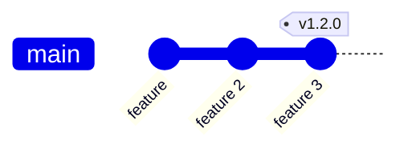
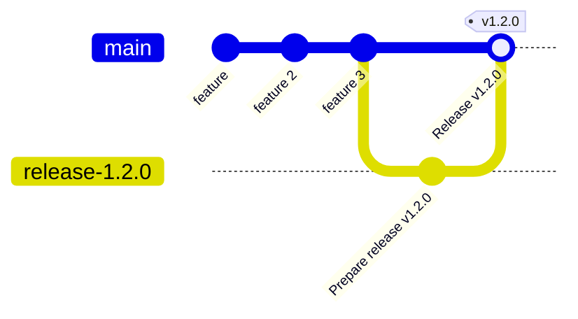
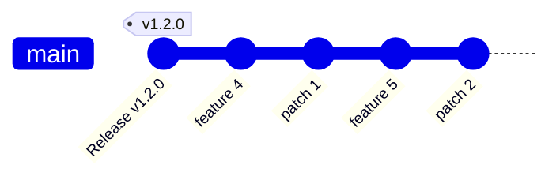

# Release Workflow

This document is both the process design (what the release model looks like) and the operational playbook (what to actually do, what breaks, what to verify). Companion to [`agents/changelog.md`](./agents/changelog.md), which is the canonical changelog process.

> **This branch runs the checks-at-rc machinery.** The sections below were written for the older model, where a maintainer pushed `vX.Y.Z` by hand and `tags.yaml` built it, opened a `chore(release): cut vX.Y.Z` PR, and force-moved the tag on merge. That is no longer how a 1.5.x release is cut, and the parts that contradict the current workflows are corrected in place. In summary, what changed:
>
> - **Pre-release tags come only from the `Cut Pre-release Tag` workflow** ([`cut-prerelease.yaml`](../.github/workflows/cut-prerelease.yaml)), dispatched from `release-1.5`. It pushes `HEAD:refs/tags/<tag>` non-forced, so the tag is write-once at the git layer and the push carries the `base_ref` that `tags.yaml` requires.
> - **Stable tags are never pushed by hand.** `tags.yaml` refuses a `vX.Y.Z` tag that has no pre-existing draft release. The stable tag is created write-once by [`pull-requests-release.yaml`](../.github/workflows/pull-requests-release.yaml) at the promote PR's merge commit.
> - **Every rc runs the full E2E suite** in [`e2e-tag.yaml`](../.github/workflows/e2e-tag.yaml), called by `tags.yaml`'s `rc-e2e` job. `promote-rc.yaml` (which lives on `main`) will not promote an rc without a green run of it.
> - **Promotion never rebuilds.** `finalize` verifies the packages candidate against the merge commit, then retags the rc's image digests to the stable tag and publishes the stable `cozy-installer` chart. `:latest` moves only when the version being promoted is the newest published stable.
> - **`auto-release.yaml` is gone.** There is no nightly patch tag. A patch is cut deliberately: `Cut Pre-release Tag` for `vX.Y.Z-rc.N`, then `Promote RC` from `main` targeting this branch.
> - **The next patch on this line is `v1.5.4`.** `v1.5.3` is a burned number: the tag exists, its GitHub release is still a draft, and its promote PR closed unmerged.

## When to use this guide

You are about to:

- Tag a release candidate (`vX.Y.0-rc.N`).
- Cut a regular release (`vX.Y.0`).
- Cut a patch release (`vX.Y.Z` with `Z > 0`).
- Triage cherry-picks before a patch release.
- Investigate why CI is misbehaving on a tag push.
- Review a `Prepare release` PR.

If you are about to generate a changelog only, jump straight to [`agents/changelog.md`](./agents/changelog.md).

## Introduction

Cozystack uses a staged release process to ensure stability and flexibility during development.

There are three types of releases:

- **Release Candidates (RC)** – Preview versions (e.g., `v1.2.0-rc.1`) used for final testing and validation.
- **Regular Releases** – Final versions (e.g., `v1.2.0`) that are feature-complete and thoroughly tested.
- **Patch Releases** – Bugfix-only updates (e.g., `v1.2.1`) made after a stable release, based on a dedicated release branch.

All three are matched by `tags.yaml`'s regex `^v\d+\.\d+\.\d+(-(alpha|beta|rc)\.\d+)?$`. The tag push is the trigger for the whole pipeline, and `tags.yaml`'s `Get base branch` step refuses a tag pushed without a `base_ref`. **Do not push tags by hand.** A pre-release comes from the `Cut Pre-release Tag` workflow, which pushes `HEAD:refs/tags/<tag>` from the dispatched branch tip so `base_ref` is populated; a stable tag comes from `finalize` at the promote PR's merge commit and is rejected by `tags.yaml` if it arrives any other way.

## Release Candidates

Release candidates are Cozystack versions that introduce new features and are published before a stable release.
Their purpose is to help validate stability before finalizing a new feature release.
They allow for final rounds of testing and bug fixes without freezing development.

Release candidates are given numbers `vX.Y.0-rc.N`, for example, `v1.2.0-rc.1`.
They are created directly in the `main` branch.
An RC is typically tagged when all major features for the upcoming release have been merged into main and the release enters its testing phase.
However, new features and changes can still be added before the regular release `vX.Y.0`.

Each RC contributes to a cumulative set of release notes that will be finalized when `vX.Y.0` is released.
After testing, if no critical issues remain, the regular release (`vX.Y.0`) is tagged from the last RC or a later commit in main.
This begins the regular release process, creates a dedicated `release-X.Y` branch, and opens the way for patch releases.

## Regular Releases

When making a regular release, we tag the latest RC or a subsequent minimal-change commit as `vX.Y.0`.
In this explanation, we'll use version `v1.2.0` as an example:


```mermaid
gitGraph
    commit id: "feature"
    commit id: "feature 2"
    commit id: "feature 3" tag: "v1.2.0"
```

A regular release sequence starts in the following way:

1. Maintainer tags a commit in `main` with `v1.2.0` and pushes it to GitHub.
2. CI workflow triggers on tag push:
   1. Creates a draft page for release `v1.2.0`, if it wasn't created before.
   2. Takes code from tag `v1.2.0`, builds images, and pushes them to ghcr.io.
   3. Makes a new commit `Prepare release v1.2.0` with updated digests, pushes it to the new branch `release-1.2.0`, and opens a PR to `main`.
   4. Builds Cozystack release assets from the new commit `Prepare release v1.2.0` and uploads them to the release draft page.
3. Maintainer reviews PR, tests build artifacts, and edits changelogs on the release draft page.

   ```mermaid
   gitGraph
       commit id: "feature"
       commit id: "feature 2"
       commit id: "feature 3" tag: "v1.2.0"
       branch release-1.2.0
       checkout release-1.2.0
       commit id: "Prepare release v1.2.0"
       checkout main
       merge release-1.2.0 id: "Pull Request"
   ```

   When testing and editing are completed, the sequence goes on.

4. Maintainer merges the PR. GitHub removes the merged branch `release-1.2.0`.
5. CI workflow triggers on merge:
   1. Moves the tag `v1.2.0` to the newly created merge commit by force-pushing a tag to GitHub.
   2. Publishes the release page (`draft` → `latest`).
6. The maintainer can now announce the release to the community.


```mermaid
gitGraph
    commit id: "feature"
    commit id: "feature 2"
    commit id: "feature 3"
    branch release-1.2.0
    checkout release-1.2.0
    commit id: "Prepare release v1.2.0"
    checkout main
    merge release-1.2.0 id: "Release v1.2.0" tag: "v1.2.0"
```

## Patch Releases

Making a patch release has a lot in common with a regular release, with a couple of differences:

* A release branch is used instead of `main`
* Patch commits are cherry-picked to the release branch.
* A pull request is opened against the release branch.


Let's assume that we've released `v1.2.0` and that development is ongoing.
We have introduced a couple of new features and some fixes to features that we have released 
in `v1.2.0`.

Once problems were found and fixed, a patch release is due.


```mermaid
gitGraph
   commit id: "Release v1.2.0" tag: "v1.2.0"
    checkout main
    commit id: "feature 4"
    commit id: "patch 1"
    commit id: "feature 5"
    commit id: "patch 2"
```


1. The maintainer creates a release branch, `release-1.2,` and cherry-picks patch commits from `main` to `release-1.2`.
   These must be only patches to features that were present in version `v1.2.0`.

   Cherry-picking can be done as soon as each patch is merged into `main`,
   or directly before the release.

   ```mermaid
   gitGraph
       commit id: "Release v1.2.0" tag: "v1.2.0"
       branch release-1.2
       checkout main
       commit id: "feature 4"
       commit id: "patch 1"
       commit id: "feature 5"
       commit id: "patch 2"
       checkout release-1.2
       cherry-pick id: "patch 1"
       cherry-pick id: "patch 2"
   ```

   When all relevant patch commits are cherry-picked, the branch is ready for release.

2. The maintainer tags the `HEAD` commit of branch `release-1.2` as `v1.2.1` and then pushes it to GitHub.
3. CI workflow triggers on tag push:
    1. Creates a draft page for release `v1.2.1`, if it wasn't created before.
    2. Takes code from tag `v1.2.1`, builds images, and pushes them to ghcr.io.
    3. Makes a new commit `Prepare release v1.2.1` with updated digests, pushes it to the new branch `release-1.2.1`, and opens a PR to `release-1.2`.
    4. Builds Cozystack release assets from the new commit `Prepare release v1.2.1` and uploads them to the release draft page.
4. Maintainer reviews PR, tests build artifacts, and edits changelogs on the release draft page.
   
   ```mermaid
   gitGraph
       commit id: "Release v1.2.0" tag: "v1.2.0"
       branch release-1.2
       checkout main
       commit id: "feature 4"
       commit id: "patch 1"
       commit id: "feature 5"
       commit id: "patch 2"
       checkout release-1.2
       cherry-pick id: "patch 1"
       cherry-pick id: "patch 2" tag: "v1.2.1"
       branch release-1.2.1
       commit id: "Prepare release v1.2.1"
       checkout release-1.2
       merge release-1.2.1 id: "Pull request"
   ```

   Finally, when release is confirmed, the release sequence goes on.

5. Maintainer merges the PR. GitHub removes the merged branch `release-1.2.1`.
6. CI workflow triggers on merge:
   1. Moves the tag `v1.2.1` to the newly created merge commit by force-pushing a tag to GitHub.
   2. Publishes the release page (`draft` → `latest`).
7. The maintainer can now announce the release to the community.

## What CI does on a tag push

Knowing which job does what makes the failure modes much easier to diagnose.

1. [`cut-prerelease.yaml`](../.github/workflows/cut-prerelease.yaml) — the only entry point for a `vX.Y.Z-rc.N` tag. Dispatch it from `release-1.5`.
2. [`tags.yaml`](../.github/workflows/tags.yaml) — runs `prepare-release`, then `rc-e2e`, then the `generate-changelog` and `update-website-docs` backstops. It builds and drafts a **pre-release** only; a stable tag finds its draft and skips straight to the backstops, and a stable tag with no draft is rejected.
3. [`e2e-tag.yaml`](../.github/workflows/e2e-tag.yaml) — the full E2E suite against a published tag's digest-pinned tree. Called by `rc-e2e`, dispatchable by hand.
4. `promote-rc.yaml` — lives on `main`, not here. Dispatched from `main` with the rc tag; it checks for a green `E2E <rc-tag> (full suite)` run, publishes the stable packages candidate, and opens the promote PR against this branch.
5. [`pull-requests.yaml`](../.github/workflows/pull-requests.yaml) — its `verify-release-candidate` job re-verifies that candidate against GitHub's prospective merge tree while the promote PR is open.
6. [`pull-requests-release.yaml`](../.github/workflows/pull-requests-release.yaml) — fires when the `release-X.Y.Z` PR merges. Verifies the candidate once more against the real merge commit, cuts the stable tag and the Go-module tag write-once, publishes the release from the changelog in that commit, then retags the rc digests to stable and pushes the stable chart.
7. [`update-releasenotes.yaml`](../.github/workflows/update-releasenotes.yaml) — fires on every push to `main`; syncs `docs/changelogs/v*.md` content into the corresponding GitHub Release body. Since the promote PR targets `release-X.Y` rather than `main`, `finalize` reads the changelog directly and this workflow is only a later-edit resync.

### Phase 1 — `prepare-release` (hard gate)

Builds images, commits digest pins, creates the draft release, publishes it as a prerelease, and creates the `release-X.Y.Z` staging branch. It no longer opens a release PR — the promote PR is opened by `promote-rc.yaml`. It also skips its whole body when a release (draft **or** published) already exists for the tag, which is how a promoted stable tag avoids being rebuilt.

The commit (`Prepare release vX.Y.Z`, authored by `cozystack-ci[bot]`) is **digest pins and image tags only**:

- `packages/core/{installer,platform,testing}/values.yaml`
- `packages/system/*/values.yaml` (cozystack-api, dashboard, kamaji, linstor, kubevirt-csi-node, etc.)
- `packages/apps/kubernetes/images/{kubevirt-csi-driver,ubuntu-container-disk-*}.tag`
- `packages/system/dashboard/templates/configmap.yaml` (the `$tenantText` value)

Things that look surprising in the diff but are normal:

- **Zero-diff packages**: when buildx fully caches and upstream base images haven't moved, the digest is byte-identical to the previous release and won't appear. Verify the build step actually ran — don't assume "no diff = nothing built."
- **Sudden churn on `ubuntu-container-disk-*` tags**: `cloud-images.ubuntu.com/noble/current/` is a moving target; these often rebuild even without code changes.
- **Switched registry**: if a self-built image moved from `docker.io` to `ghcr.io`, the registry portion of the digest changes — that's a deliberate move, not a regression.
- **`targetVersion` is NOT touched by the release PR.** Platform migration `targetVersion` is bumped earlier in a feature commit (e.g. `[platform] Bump migration targetVersion to 39 for migration 38`). The release PR only re-pins the `platform-migrations` image digest.

### Phase 2 — `generate-changelog` (non-blocking)

Uses a separate **read-only** GitHub App token (`permission-contents: read`, `permission-pull-requests: read`, `permission-metadata: read`) for the AI step, so the model cannot mutate the repo even with `--allow-all-tools`. Branch creation, commit, push, and PR creation happen in subsequent steps under a write-scoped token.

The job runs with `continue-on-error: true`. A green tag CI run does **not** imply a changelog landed — check that the `changelog-vX.Y.Z` PR exists with content. If it does not, follow [`agents/changelog.md`](./agents/changelog.md) manually.

Known reasons this phase fails silently:

- Copilot quota exhausted (`COPILOT_GITHUB_TOKEN` 402). Refill or rotate. Drafts still get created by Phase 1; you have to open the changelog PR by hand.
- AI step timeout (hard 30-min cap).
- Output file empty — caught by the next step's `[ -s ]` check, fails loudly.

### Phase 3 — `update-website-docs`

Runs with `if: always() && needs.prepare-release.result == 'success'` so it survives a failed changelog phase. Decides whether to promote `next/` → `vX.Y/` in the website repo (only for non-prerelease tags where the version directory doesn't yet exist), runs `make update-all`, then stages `content hugo.yaml data/versions` and opens a PR against `cozystack/website`.

If anyone changes the website Makefile to write somewhere else (e.g. `static/`, `i18n/`), the `git add` list must grow or the PR silently drops files.

### Phase 4 — review and merge the promote PR

Opened by `promote-rc.yaml` as `cozystack-ci[bot]` from `release-X.Y.Z` into `release-X.Y`, carrying the `release` label. E2E does **not** run on it by default; the rc's own full suite is the evidence, and repeating it would re-test container digests that are bit-for-bit identical. Add the `full-e2e` label and push to the branch if you want it anyway, or dispatch `e2e-tag.yaml` against the tag.

Reviewer checklist:

- [ ] Diff is digest pins + image tags only — nothing else.
- [ ] No accidental config drift (a value file you don't recognize).
- [ ] If any chart bumped, check the new digest pulls — `crane manifest ghcr.io/cozystack/cozystack/<name>@<digest>` should return.
- [ ] Build artifacts on the draft release page exist and match the expected count.
- [ ] Changelog PR exists, has content, and the entries match the commit range (see [Changelog pre-publish verification](#changelog-pre-publish-verification)).

### Phase 5 — `pull-requests-release.yaml` (finalize)

Fires on merge of a PR with the `release` label, a head branch matching `release-X.Y.Z[-suffix]`, and `cozystack-ci[bot]` as its author. In order:

1. **Verify the packages candidate.** `hack/verify-promoted-packages.sh` runs from the pre-merge base SHA against the merged packages tree: same files, same bytes, same executable bits, no rc image references left, and the same container repo/digest set as the rc artifact. This is the last chance before any write-once name exists, and it fails closed.
2. **Create the tag at the merge commit, write-once.** No force. A tag already at this SHA is a no-op; a tag at a different SHA is a hard failure. `api/apps/v1alpha1/vX.Y.Z` is cut the same way, stable tags only.
3. **Fast-forward the maintenance branch `release-X.Y`.** Created if missing, fast-forwarded if a descendant, left alone with a warning otherwise — never rewound.
4. **Publish the release**, with `docs/changelogs/vX.Y.Z.md` from the merge commit as the body. `make_latest` is computed against published-non-prerelease tags: prereleases stay `false`; tags older than the current max stay `false` (and the current max is restored to `latest` if necessary, so an older patch tag cut after a newer minor won't downgrade `latest`).
5. **Promote the registry side.** `hack/promote-retag.sh` copies each rc digest to `<repo>:vX.Y.Z` — no rebuild, write-once per destination tag — moving `:latest` only when step 4 decided this is the newest stable. Then the stable `cozy-installer` chart is packaged from the merged tree, with `cozystackOperator.platformVersion` stamped on the working tree only, and pushed.

### Phase 6 — `update-releasenotes.yaml` (sync GitHub Release body)

Fires on every push to `main`. Reads each `docs/changelogs/vX.Y.Z.md` and PATCHes the matching GitHub Release's `body` if it differs. So edits to a published changelog file land on the GitHub Release on the next push to `main`, without re-running the release flow.

## Cutting a patch (there is no nightly auto-patch)

`auto-release.yaml` has been deleted. It cron-tagged the newest `vX.Y.(Z+1)` on the two newest lines by **deleting and re-creating** the tag, which is incompatible with write-once stable tags and with `tags.yaml`'s refusal of a stable tag that has no draft. Nothing replaces it: a patch is now cut deliberately, and a commit landing on `release-1.5` no longer ships within 24h by itself.

The sequence for `v1.5.4`:

1. Cherry-pick or backport the fixes onto `release-1.5` and let them merge.
2. Run **Cut Pre-release Tag** from `release-1.5` with `v1.5.4-rc.1`. It refuses a stable tag, refuses a tag that already exists, refuses a stale branch tip, and refuses a line that does not match the dispatch branch.
3. `tags.yaml` builds the rc, publishes it as a prerelease, creates the `release-1.5.4-rc.1` staging branch, and runs the full E2E suite as `E2E v1.5.4-rc.1 (full suite)`.
4. Validate the rc. If it needs another turn, cut `v1.5.4-rc.2` — rc numbers are cheap, `v1.5.4` is not.
5. Run **Promote RC** from `main` with the rc tag. It refuses to start unless this branch carries the candidate-aware pipeline, and refuses to promote without the green run from step 3.
6. Review and merge the promote PR. `finalize` does everything irreversible from there.

## Backports

### The backport bot

[`backport.yaml`](../.github/workflows/backport.yaml) wraps [`korthout/backport-action`](https://github.com/korthout/backport-action) and fires on a merged `main`-targeted PR carrying one of:

| Label | Target branch |
|-------|---------------|
| `backport` | `release-X.Y` (current latest minor) |
| `backport-previous` | `release-X.(Y-1)` |

Resolution is dynamic via `getLatestRelease` at run time — no need to hardcode branch names.

The bot creates a backport PR with title `[Backport release-X.Y] <original title>`. When this PR merges, the title prefix used to re-trigger the bot through `pr-labeler.yaml`, which auto-applied `backport` to any `[Backport release-X.Y]`-titled PR. Combined with the org-level `dosubot` re-applying the label, this caused recursive backports.

The fix (PR #2584): both job `if:` blocks gate on `github.event.pull_request.base.ref == 'main'`. Backport PRs target `release-X.Y`, so they cannot satisfy this — architectural protection, regardless of which bot relabels them.

### When the bot fails

Conflicting cherry-picks produce a draft PR via `conflict_resolution: draft_commit_conflicts`. Look for the bot's comment with the merge-conflict diff. You either:

- Resolve in the draft branch and undraft, or
- Drop the bot's branch and cherry-pick manually:

```bash
git checkout release-X.Y
git cherry-pick -x -s <commit-sha>
# resolve conflicts
git commit -s
git push origin release-X.Y  # or push to a new branch and open a PR
```

To find the bot's failed comments across a batch of PRs:

```bash
for n in $(gh pr list --search "label:backport label:backport-previous merged:>=2026-01-01" --json number --jq '.[].number'); do
  echo "=== #$n ==="
  gh pr view $n --json comments --jq '.comments[] | select(.author.login == "github-actions" or (.author.login | contains("backport"))) | .body' | head -20
done
```

### Cherry-pick triage before a patch

A patch release includes bugfixes for code that shipped in the corresponding minor `vX.Y.0`. Use:

```bash
# 1. Inventory PRs already labeled for backport (merged but not yet on release-X.Y)
gh pr list --search "is:merged label:backport" --limit 100
gh pr list --search "is:merged label:backport-previous" --limit 100

# 2. List commits on main since the release branch diverged that are NOT yet on release-X.Y
git merge-base origin/main origin/release-X.Y
git log <base>..origin/main --grep="(#" --oneline

# 3. Open PRs that may need labeling before the cut
gh pr list --state open --base main --label kind/bug
```

**Include rule:**

- `kind/bug` — especially destructive (data loss, crash-loop, OOM, eviction).
- `area/security` / CVE.
- Narrow chart fixes whose blast radius is contained (e.g. one operator's resources).
- Patch-line-policy-matching dependency bumps (e.g. cilium 1.X.Y → 1.X.(Y+1) on a `release-A.B` shipping cilium 1.X — never a minor bump, only a patch within the line the branch already ships).

**Skip rule:**

- `kind/feature` — even with `lgtm`. A patch release is not a delivery vehicle for features.
- CI-only changes (`area/ci`, test infrastructure).
- Docs-only changes (those land via `update-website-docs` automatically).
- Large multi-package dependency churn (Dependabot Go-deps bumps).
- PRs whose conventional-commit type is `!` (breaking) or that mix `feat` with `fix`.

**Borderline cases:**

- Large refactors with `lgtm` AND an obvious bug payload — prefer extracting the bug fix into a narrower commit and backporting only that.
- PRs labeled both `kind/bug` and `kind/feature` — split them.

### Backporting code that touches monotonic counters

Migrations are the canonical case. `packages/core/platform/images/migrations/run-migrations.sh` is a linear counter — it runs `seq $CURRENT_VERSION $((TARGET_VERSION - 1))` and stops if `CURRENT >= TARGET`. This creates a forward-upgrade trap. Walking through it with `release-1.2` as the maintenance branch:

- `main` has `targetVersion=10` and migrations 1–9 on disk.
- The `release-1.2` branch was cut when `targetVersion=5` (migrations 1–4 on disk).
- You backport a new migration to `release-1.2` at slot 5, and naively bump `targetVersion` 5 → 6 to enable it.
- Customer running 1.2.x runs the new migration, stamps `cozystack-version=6` in-cluster.
- On upgrade to 1.3 (main's `targetVersion=10`), the runner walks `seq 6 9` and runs main's migrations 6–9 — **main's own migration at slot 5 never runs.** The backport claimed that slot on `release-1.2`; main's slot 5 holds an unrelated migration that gets silently skipped.

Mitigations, in order of preference:

1. **Don't bump `targetVersion` in the backport.** Just ship the migration file. Prior precedent in the repo: an earlier maintenance branch's ACME backport did exactly this — the migration shipped but ran on no clusters until a later commit raised the counter. Pair this with relaxing the chart-side `{{ fail }}` guard on the maintenance branch (chart-side coalesce) so the new value works without the migration having executed.
2. **If you must bump,** add an idempotent duplicate of the now-skipped main migration at a higher slot. Bounded cost (one extra file per affected migration) and survives the skip window.
3. **Audit cross-branch counter state before deciding.** Compare migration numbering across `main`, `release-X.Y`, and `release-X.(Y-1)`. If a backport would create a skip window on any forward-upgrade path, choose option 1.

This rule generalizes to any monotonic-counter state: schema versions, feature-flag generations, anything that gates "have I run X yet?" with a single integer.

## Changelogs

### Where the canonical process lives

[`agents/changelog.md`](./agents/changelog.md) is the source of truth. Read it end-to-end before generating; do not infer the process from past commits or memory. The CI runs it under Copilot via `tags.yaml::generate-changelog`; locally the same prompt is replayable by following the doc directly.

### Common changelog failure modes

These are mistakes that have shipped in real changelogs. Verify against each before merging the changelog PR.

**1. Commits from outside the release range.** Caused by running `git log <prev>..HEAD` from `main` while generating a patch changelog — `HEAD` on `main` contains everything that landed since the tag plus backports merged to `release-X.Y` after the tag was cut. Use `git log <prev>..<new_tag>` explicitly. The doc was updated to require this after v1.3.1's changelog shipped with 14 entries for what was actually a 1-commit release.

**2. Original + backport listed as two separate entries.** Each backport must coalesce with its original into a single entry of the form `(in #orig, backport #bp)`. To verify after generation:

```bash
# Every entry that mentions "backport" should also reference the original PR number
grep -E 'backport #[0-9]+' docs/changelogs/v<new>.md | grep -v '#[0-9]*, backport'
```

Output should be empty.

**3. Wrong PR author.** The squash-merge commit's author is whoever clicked "Merge" — not the person who wrote the code. **Always** resolve via `gh pr view <N> --json author --jq .author.login`, never `git log --format=%an`. This bites hardest for website-repo entries where the same merger handles most PRs.

**4. Re-cut tag, stale changelog.** If you re-tag (force-move `vX.Y.Z` to a new commit because a critical fix landed), the changelog PR may already exist for the old tag. Compare `git log <prev>..<new>` against what the existing `changelog-vX.Y.Z` branch already documents; only add/remove the deltas. If the only new commits are CI-internal or a revert of a feature that never reached a stable tag, no changelog edit is needed.

**5. PR numbers swapped inside prose.** The entry-format validator checks bullet entries but ignores Feature Highlights paragraphs and Upgrade Notes. Both have caused wrong PR references in shipped changelogs. Verify every `#NNNN` in prose with `gh pr view <N>`.

**6. Hallucinated entries.** Every entry must correspond to a commit in `git log <prev>..<new>`. Verify by extracting PR numbers from the file and grep-searching the commit range:

```bash
grep -oE '#[0-9]+' docs/changelogs/v<new>.md | sort -u | while read pr; do
  n=${pr#\#}
  if ! git log <prev>..<new> --grep="#${n}" --oneline | grep -q .; then
    echo "PR $pr in changelog but not in commit range"
  fi
done
```

**7. Bot accounts as human contributors.** `cozystack-ci[bot]`, `github-actions`, `dependabot`, `renovate`, and any `app/*` login must NOT appear in the `## Contributors` list. They legitimately appear in **per-entry attribution** (e.g. a Renovate-authored PR) — but not in the human roll-call.

**8. Title duplicated as description.** `* **fix(foo): X**: fix(foo): X (...)` means you wrote the conventional-commit subject twice and never wrote a user-facing description. The brief and the detail must say different things — the detail explains what the change means for users.

### Changelog pre-publish verification

Run these checks before merging the changelog PR. Catches problems in roughly the order they occur:

```bash
PREV=v1.2.0; NEW=v1.2.1

# A. Every chart bump is mentioned somewhere in the changelog
git diff --name-only $PREV..$NEW -- 'packages/*/charts/*/Chart.yaml' 'packages/*/*/charts/*/Chart.yaml' | while read f; do
  old=$(git show "$PREV:$f" 2>/dev/null | yq '.version // ""')
  new=$(git show "$NEW:$f" 2>/dev/null | yq '.version // ""')
  if [ "$old" != "$new" ]; then
    component=$(basename "$(dirname "$f")")
    if ! grep -qi "$component" docs/changelogs/$NEW.md; then
      echo "MISSING: $component $old -> $new ($f)"
    fi
  fi
done

# B. Out-of-Chart.yaml pins (Talos, tenant K8s, vendored images)
for path in packages/core/talos/values.yaml packages/core/installer/values.yaml packages/apps/kubernetes/values.yaml; do
  git diff $PREV..$NEW -- "$path" | head -40
done
git diff --name-only $PREV..$NEW -- 'images/*/Dockerfile'

# C. Every cited #NNNN exists and is a merged PR (not an issue)
grep -oE '#[0-9]+' docs/changelogs/$NEW.md | sort -u | sed 's/#//' | xargs -P 20 -I{} sh -c '
  state=$(gh api /repos/cozystack/cozystack/issues/{} --jq ".pull_request.merged_at // \"ISSUE\"" 2>/dev/null)
  echo "#{} $state"
' | grep -E 'ISSUE|null|^#[0-9]+ $'

# D. URL liveness
grep -oE 'https://[^)" ]+' docs/changelogs/$NEW.md | sort -u | xargs -P 10 -I{} sh -c '
  code=$(curl -s -o /dev/null -w "%{http_code}" {})
  if [ "$code" != "200" ]; then echo "$code {}"; fi
'

# E. Website PR authors are PR authors, not commit authors
grep -oE 'cozystack/website#[0-9]+' docs/changelogs/$NEW.md | sort -u | sed 's|cozystack/website#||' | while read n; do
  pr_author=$(gh pr view $n --repo cozystack/website --json author --jq .author.login)
  echo "website#$n -> @$pr_author"
done

# F. Working tree clean except for the changelog
git status --porcelain | grep -v "docs/changelogs/$NEW.md"
# Should output nothing.
```

Ship criterion: every chart bump surfaced, no issue-cited-as-PR, no 404 URLs, every website entry attributed via `gh pr view` (not commit author), `git status` shows only the changelog.

### Cozystack-specific URL quirks

`cozystack.io` paths are versioned: `/docs/operations/foo/` and `/docs/next/foo/` both 404. Only `/docs/vX.Y/foo/` and the unversioned canonical `/docs/foo/` serve content. AI-generated changelogs invent the unversioned form. Verify URLs with the `curl` loop above.

### Platform-component coverage

For a minor release (`vX.Y.0`), changelog entries should surface what an upstream chart bump actually brought in — features, breaking changes, security fixes. PR commit messages usually don't capture this; the upstream `CHANGELOG.md` or GitHub Release notes do. For each bumped `Chart.yaml`:

1. Read the `sources:` field — typically a GitHub URL.
2. Fetch release notes strictly inside `old < x <= new` via `gh release view <tag> --repo <owner>/<repo> --json body,name`.
3. Summarize in 2–5 user-impact bullets per component (new features, breaking changes, CVEs, important deprecations). Don't reproduce upstream notes verbatim; link to them.
4. If a PR-level entry already mentions the bump, enrich that entry with bullets — don't duplicate the entry.
5. If 3+ bumps have no PR-level mention, introduce a `## Platform Components` section.

If you can't find upstream notes for a bumped component, list it with version-only info and no bullets. Hallucinated bullets are worse than missing detail.

## Release-time fires — what's gone wrong recently

These are real regressions that escaped to users. The pattern in each: code passed CI, shipped in a stable release, broke customers. Read them as a working list of pre-release verification gaps.

### v1.3.0 — cert-manager ingressClassName regression (fix #2562)

**Bug:** A commit migrated ACME HTTP-01 to use the modern `acme.cert-manager.io/http01-ingress-ingressclassname` annotation. The matching ingress-shim code that reads that annotation was added by cert-manager upstream PR #8244 and was **never backported** to the `release-1.19` branch — but cozystack 1.3.0 shipped cert-manager v1.19.3. The annotation was silently dropped at runtime and every solver Ingress fell back to the ClusterIssuer's default class `tenant-root`. Let's Encrypt validation broke for every tenant whose `publishing.ingressName != tenant-root`.

**Blast radius:** v1.3.0, v1.3.1, and v1.1.7 (the migration was cherry-picked to `release-1.1`).

**Why CI missed it:** the migration commit was self-contained and `helm template` rendered cleanly. There was no E2E that creates a tenant with a non-default ingress class and watches a real Let's Encrypt cert issue. Verification had been done from the docs side ("the API has been available since cert-manager 1.12"), not against the shipped cert-manager source.

**Would have caught it:** non-root-tenant E2E with LE-staging cert issuance, asserting the solver Ingress lands on the tenant's class.

### v1.4.0 — kubevirt-instancetypes upgrade failure (fix #2612)

**Bug:** `packages/system/kubevirt-instancetypes/Makefile` contained `sed -i '/persistent: true/d' templates/preferences.yaml`, which stripped the only child of `preferredTPM`, leaving `preferredTPM:` (null) in six Windows preferences. KubeVirt v1.6.x silently accepted it. The v1.6.3 → v1.8.2 operator bump (2026-04-27) hardened the CRD's OpenAPI schema and started rejecting null for an object-typed field. `helm upgrade` then failed on every cluster with `kubevirt-instancetypes` enabled.

**Why CI missed it:** the kubevirt-operator bump and the inert `preferences.yaml` were two weeks apart in commit history. CI only tests fresh installs against the new CRDs; it doesn't run `helm upgrade` from prior versions. Schema regression on a vendored asset that hadn't been touched in 18 months.

**Would have caught it:** `helm template <new chart> | kubectl apply --dry-run=server -f -` against the freshly-installed CRDs of every bumped operator. Or an upgrade-from-N-1 E2E lane.

### v1.4.0 — Flux 2.7 → 2.8 readiness deadlock (#2602)

**Bug:** helm-controller v1.5.0 (shipped in Flux 2.8) changes the default wait strategy to kstatus polling, which polls **every applied resource including child HelmReleases**. The `packages/apps/kubernetes` umbrella has 19 child HRs that each `dependsOn: parent` (with a `lookup` guard so the dependency only activates after the parent exists). Pre-2.8: parent went Ready as soon as Helm returned. Post-2.8: parent waits for children, children wait for parent. Deadlock.

**Why CI missed it:** the cycle only manifests on the second reconcile (parent exists, so the `lookup` activates the child's `dependsOn`). Fresh-install E2E dodges this — the parent-already-exists branch isn't taken on the first apply.

**Would have caught it:** apply-mutate-reapply E2E (any chart bump in the kubernetes umbrella triggers a second reconcile). Plus an explicit PR-template requirement: for any flux/helm-controller bump, paste the upstream breaking-changes section into the PR body.

### Patterns these share

1. **Fresh-install CI is insufficient.** All three regressions passed fresh-install lanes.
2. **Upstream breaking-defaults bumps are the common shape.** kubevirt CRD hardening, helm-controller default wait strategy, cert-manager API surface drift. Pre-merge reading of upstream changelogs would have caught two of three.
3. **One-engineer-bitten-once is the only safety net for live verification.** The cert-manager bump PR included an explicit live-cluster verification step — because the same engineer had been bitten the prior week. There is no checklist requiring it.

## Pre-release verification checklist

For RCs and final releases, run this before merging the release PR. Each item is here because something has shipped without it and broken users.

- [ ] **Upgrade from previous patch** (`vX.Y.(Z-1)`) on a real cluster. `helm upgrade` succeeds, all HelmReleases reach Ready, no CRD schema rejections.
- [ ] **Upgrade from previous minor** (`v(X-1).Y.0`) for RC and minor releases. Same assertions.
- [ ] **At least one tenant with `publishing.ingressName != tenant-root`** and a real Let's Encrypt-staging cert issuance.
- [ ] **Apply-mutate-reapply** on the kubernetes umbrella HelmRelease (catches second-reconcile bugs).
- [ ] **For every CRD-source bump** (kubevirt, cert-manager, flux, cilium, kamaji): `helm template | kubectl apply --dry-run=server` against the freshly-installed CRDs.
- [ ] **For every flux / helm-controller / kubevirt-operator / cert-manager bump:** paste the upstream breaking-changes section of the bump's CHANGELOG into the PR body before merge.
- [ ] **After cutting the tag,** watch `pull-requests-release.yaml::Finalize Release`. If it fails on `Draft release for v... not found`, undraft the release manually and file the workflow regression — this has been a known recurring failure since the `Publish draft release` step lost its explicit `github-token` in refactor `66a756b6`.
- [ ] **Changelog PR exists and was verified** per [Changelog pre-publish verification](#changelog-pre-publish-verification).

## CI failures release engineers commonly hit

| Symptom | Class | Diagnosis | Block release? |
|---------|-------|-----------|----------------|
| `Draft release for vX.Y.Z not found` on every release-* merge | Workflow regression — `Publish draft release` lost its `github-token` in a past refactor; default `GITHUB_TOKEN` cannot list drafts | At `pull-requests-release.yaml:163`. Undraft manually, file the fix | No |
| Changelog Copilot job returns 402 | Token quota — `COPILOT_GITHUB_TOKEN` premium-request quota empty | All tag CI runs that day fail the changelog phase | No — `continue-on-error: true`, generate changelog by hand following [`agents/changelog.md`](./agents/changelog.md) |
| E2E `kubernetes-test` fails with `CSINode does not contain driver csi.kubevirt.io` | Test ordering bug | Tenant's `kubernetes-${test_name}-csi` HelmRelease still installing when NFS PVC is created. Fix: wait for `csinode/<node>` to advertise the driver before creating the PVC | Yes — flaky and masks real CSI bugs |
| `tenant-root` HR in perpetual upgrade-rollback loop after OIDC patch | Real bug at the intersection of #2602's readiness change and the cozystack reconcile cadence | Look for `rate: Wait(n=1) would exceed context deadline` in operator logs; multiple tenant child HRs stuck `InProgress` | Yes |
| `cozy-dashboard` ImagePullBackOff from `cozystack-ui:latest` | Registry flake | Known noisy on some OCI mirrors; not currently in the prepull set | No — retry |
| PR CI: `docker push` 409 on `:latest` for the same image across two PRs | Concurrent manifest race on a shared floating tag | The `:latest` tag was previously written by every `make image` regardless of PR. Resolved by the image-tag refactor (`IMAGE_TAG=pr-<N>-<sha>` in PR builds, `IMAGE_TAG=<ref_name>` only at release time) | No — `gh run rerun --failed` |

**Heuristic:** workflow-token and Copilot-quota issues are out-of-band — release the tag, fix the workflow in a follow-up PR. Test ordering bugs and tenant-root reconcile storms are real and should block.

If you find yourself doing the same manual fixup on two consecutive releases (e.g. "undraft the release"), open a workflow-regression issue. Workflow bugs with known manual workarounds rot silently for months.

## Force-retagging

This is mostly history now. The rc-promotion flow of [#2677](https://github.com/cozystack/cozystack/issues/2677) landed, and every tag CI creates on this line is write-once:

| File | Operation | Forced? |
|------|-----------|---------|
| [`cut-prerelease.yaml`](../.github/workflows/cut-prerelease.yaml) | `git push origin HEAD:refs/tags/<tag>` for a pre-release | No — non-forced, plus an `ls-remote` write-once guard that distinguishes "absent" from "could not tell" |
| [`tags.yaml`](../.github/workflows/tags.yaml) | Create or update the `release-X.Y.Z` staging branch | Compare-before-force: no push when unchanged, a logged `::notice::` force only when it genuinely moves. Legitimate — this is a mutable staging branch, and a re-run produces a fresh non-reproducible bake commit |
| [`pull-requests-release.yaml`](../.github/workflows/pull-requests-release.yaml) | Create `vX.Y.Z` and `api/apps/v1alpha1/vX.Y.Z` at the merge commit | No — created when absent, no-op when already at this SHA, hard failure when pointing elsewhere |
| [`pull-requests-release.yaml`](../.github/workflows/pull-requests-release.yaml) | Update `release-X.Y` | No — `force: false`, so a non-fast-forward is a 422 that warns and leaves the branch for a maintainer |
| [`hack/promote-retag.sh`](../hack/promote-retag.sh) | `<repo>:vX.Y.Z` in the registry | No — resolves the destination manifest first, no-op if it already points at this digest, refuses if it points elsewhere. `:latest` is the one deliberately mutable tag, and moves only for the newest published stable |

Why the old force mattered, and why it no longer does: the maintainer used to push `vX.Y.Z` first, CI baked vendored image digests onto a side branch, and on PR merge the workflow **moved** the tag onto the merge commit. The tag existed before the tree it was supposed to describe. Now the stable tag is born at the merge commit, so there is never a prior SHA to overwrite and a force is impossible by construction.

Why the old shape was a smell: the Go module proxy and pkg.go.dev cache `api/apps/v1alpha1/vX.Y.Z` immutably, so retagging causes silent downstream version skew. The same applies to SBOM and provenance toolchains. That tag is now cut only for a stable release, only at the merge commit, only once.

`auto-release.yaml` was the last delete-then-recreate on a stable tag and has been removed.

Capacity sanity-check for the rc-promotion model: GitHub has no documented per-repo tag cap; performance pain begins around 10k tags. Nightly RC tags would produce ~365/yr → ~1,800 in 5 years, well under. Real cost vectors are GHCR storage, GitHub Release assets, and self-hosted runner compute — needs explicit retention from day one if/when this lands.

## Splitting a release-blocking bundle PR

Sometimes the work that has to land before a release is a 40-commit grab bag (CI stabilization, dependency bumps, chart fixes). Splitting it makes it reviewable and survivable. The strategy that has worked:

1. **Verify what's already on `main`.** Use `git merge-base --is-ancestor` and subject grep to drop commits that have already landed.
2. **Find existing open PRs that cover the same commits.** Force-push to the existing branch instead of opening a duplicate — preserves review threads.
3. **Identify the "bottleneck" PR.** The one whose changes make previously-silent misconfigurations into hard errors (typically an operator-version bump). Everything else can fan out in parallel.
4. **Squash iterative same-author bug-on-bug fixes** inside each split. Preserve authorship via `--author` on the squashed commit.
5. **Mark the keystone PR as draft** and link in the body to the dependency PRs. Reviewers know it intentionally fails CI until the chain lands.
6. **Beware of concurrent registry pushes.** When fanning out 5+ PR CI runs simultaneously, multiple `make image` jobs can collide on shared floating tags. The `IMAGE_TAG=pr-<N>-<sha>` refactor solved this; if you see `Conflicted with another upload of the same manifest`, `gh run rerun --failed`.

## Cleanup after release

- The `release-X.Y.Z` branch is deleted by GitHub when its PR merges. The `release-X.Y` maintenance branch is created or fast-forwarded by `pull-requests-release.yaml::Ensure maintenance branch`.
- The draft release is published by the same workflow.
- The `update-releasenotes.yaml` workflow syncs `docs/changelogs/vX.Y.Z.md` into the GitHub Release body on the next push to `main`. Edits to a published changelog file land on the release page the next time `main` moves.
- Local cleanup: remove your worktree (`git worktree remove`) and prune merged release branches.

## See also

- [`agents/changelog.md`](./agents/changelog.md) — canonical changelog generation process.
- [`agents/contributing.md`](./agents/contributing.md) — commit/PR conventions, backport label semantics.
- [`agents/releasing.md`](./agents/releasing.md) — pointer file for AI agents handling release tasks.
- [`.github/workflows/cut-prerelease.yaml`](../.github/workflows/cut-prerelease.yaml) — the only entry point for a pre-release tag.
- [`.github/workflows/tags.yaml`](../.github/workflows/tags.yaml) — tag-push pipeline.
- [`.github/workflows/e2e-tag.yaml`](../.github/workflows/e2e-tag.yaml) — full E2E suite for a published tag; the promote gate's evidence.
- [`.github/workflows/pull-requests-release.yaml`](../.github/workflows/pull-requests-release.yaml) — merge-finalize pipeline: candidate verification, write-once tags, registry promotion.
- [`.github/workflows/backport.yaml`](../.github/workflows/backport.yaml) — automatic cherry-pick bot.
- [`.github/workflows/update-releasenotes.yaml`](../.github/workflows/update-releasenotes.yaml) — sync changelog → GitHub Release body.
